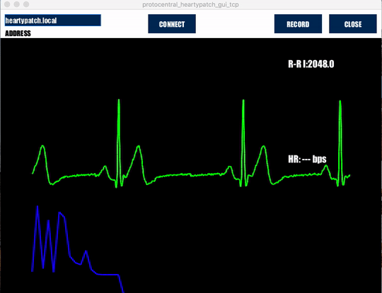

## Getting live ECG data from HeartyPatch over WiFi/TCP

The firmware for the HeartyPatch's on-board Espressif ESP32 chip uses the [esp-idf framework](https://github.com/espressif/esp-idf)
 for development. You will need to install and configure the following components to setup a development environment:

 * The Xtensa ESP32 toolchain (*Plase make sure download the toolchain from the links at: http://esp-idf.readthedocs.io/en/v2.1/get-started/index.html#standard-setup-of-toolchain*)
 * The v2.1 release of esp-idf (*this is the most stable release with the required features*)
 * Supporting software such as Python and pyserial

**Please make sure all of the above tools are properly installed before proceeding.**

**The current version of the HeartyPatch code compiles well and performs well only with v2.1 of the ESP-IDF and version 1.22.0-61-gab8375a-5.2.0 of the Xtensa toolchain.**

Setup guides for these components are available on the [ESP-IDF documentation site](https://esp-idf.readthedocs.io/en/latest/get-started/index.html).

You can then clone our [Github repository](https://github.com/Protocentral/protocentral_heartypatch) of code for the ESP32:

`git clone https://github.com/Protocentral/protocentral_heartypatch.git`

[or download a zip file of the latest master branch](https://github.com/Protocentral/protocentral_heartypatch/archive/master.zip).

Download this zip file, rename it to whatever you want to. Change to this directory and then start building.

The folder `heatypatch-stream-tcp` contains the code for streaming ECG.

Before flashing this code, enable wifi, TCP and mdns through `makemenuconfig` similar to the process described in the previous section.

* Start makemenuconfig and navigate to *Heartypatch configuration*, set your wifi ssid and password, enable mdns and TCP:

* Configure the serial port under Serial flasher config -> Default serial port
* Navigate to *Component config -> esp32-specific ->main XTAL frequency* and select 26 MHz as the board crystal

Run the makefile (assuming previous steps are done correctly):

`make` or `make -j5`

To flash the firmware on to the board, just use:

`make flash`

If the flashing is successful, you should see something similar to the below screen:

You can open the IDF monitor to see the debug messages by using the command:

`make monitor`

If all goes well and the HeartyPatch gets connected to your specified Wi-Fi network, you should see something like the following:

You can download the TCP client GUI for your platform from this link:

[Download TCP Client GUI](https://github.com/Protocentral/protocentral_heartypatch/releases/latest)

After you unzip and run the executable program on your computer, choose the default address (heartypatch.local) and click connect. You should see a screen like this:

Congratulations !

If something doesn't work, please email us your problem at [support@protocentral.com](mailto:support@protocentral.com)

More information about this process and the ESP32 framework is available in the [ESP32 Get Started Guide](http://esp-idf.readthedocs.io/en/latest/get-started/).
