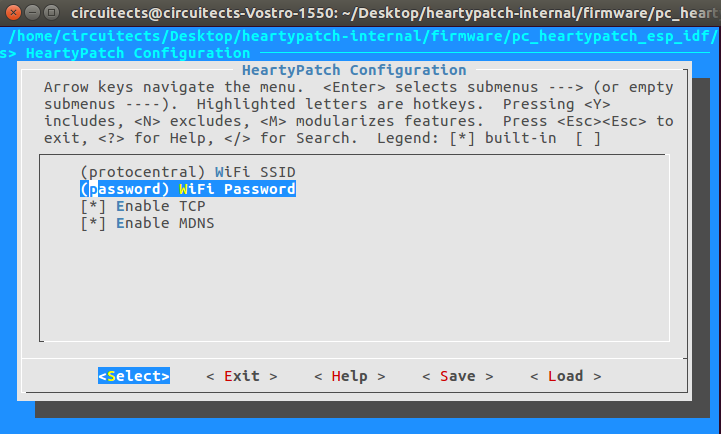

## Getting live ECG data from HeartyPatch over WiFi/TCP

The firmware for the HeartyPatch's on-board Espressif ESP32 chip uses the [esp-idf framework](https://github.com/espressif/esp-idf)
 for development. You will need to install and configure the following components to setup a development environment:

* The Xtensa ESP32 toolchain
* The v2.1 release of esp-idf
* Supporting software such as Python and pyserial

**Please make sure all of the above tools are properly installed before proceeding.**

Setup guides for these components are available on the [ESP-IDF documentation site](https://esp-idf.readthedocs.io/en/latest/get-started/index.html).

You can then clone our [Github repository](https://github.com/Protocentral/protocentral_heartypatch) of code for the ESP32:

`git clone https://github.com/Protocentral/protocentral_heartypatch.git`

[or download a zip file of the latest master branch](https://github.com/Protocentral/protocentral_heartypatch/archive/master.zip).

Download this zip file, rename it to whatever you want to. Change to this directory and then start building.

The folder `heatypatch-stream-tcp` contains the code for streaming ECG.

Before flashing this code, enable wifi, TCP and mdns through `makemenuconfig` similar to the process described in the previous section.

* Start makemenuconfig and navigate to *Heartypatch configuration*, set your wifi ssid and password, enable mdns and TCP:

* Configure the serial port under Serial flasher config -> Default serial port
* Navigate to *Component config -> esp32-specific ->main XTAL frequency* and select 26 MHz as the board crystal

Run the makefile (assuming previous steps are done correctly):

`make` or `make -j5`

To flash the firmware on to the board, just use:

`make flash`

If the flashing is successful, you should see something similar to the below screen:

You can open the IDF monitor to see the debug messages by using the command:

`make monitor`

Once the heartypatch is connected with the wifi, open the gui from the project folder and you should be able see the ECG stream.  

More information about this process and the ESP32 framework is available in the [ESP32 Get Started Guide](http://esp-idf.readthedocs.io/en/latest/get-started/).
